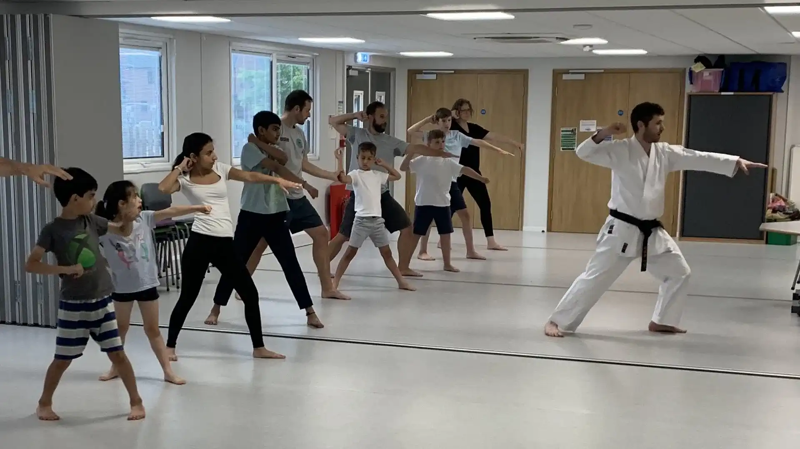

# Northstowe Karate Club

At Northstowe Karate Club, we are committed to teaching traditional Shotokan Karate in a supportive and friendly environment. Whether you are a beginner or an experienced practitioner, our club offers a place for everyone to learn, grow, and achieve their personal best. Northstowe Karate Club is proud to serve our local community in Northstowe while being part of the wider Cambridge martial arts scene.

## Key information

  <ul class="info-box-list">
    <li><strong>When:</strong> Wednesdays 6.30-7.30pm & Sundays 3-4pm. View our <a href="/training/">training schedule</a> for more information</li>
    <li><strong>Where:</strong> The Cabin, Northstowe (<a href="https://maps.app.goo.gl/wXcMAGknwyPFEgMp6" target="_blank">View map</a>)</li>
    <li><strong>How to Book:</strong> <a href="/lesson-booking/">Book your first lesson here</a> (first lesson free!)</li>
    <li><strong>Who:</strong> Ages 8+ (6-7 by arrangement), adults & families welcome</li>
    <li><strong>Fees:</strong> <a href="/training/fees/">Pay per session</a> after your free first lesson. Membership required for permanent students.</li>
    <li><strong><a href="/benefits-of-karate/">Benefits:</a></strong> Improve fitness, confidence, focus, and self-defence. Make friends in a supportive club.</li>
    <li><strong>What to Bring:</strong> Comfortable sports clothing, water bottle. No uniform needed for first lesson.</li>
    <li><strong>Contact:</strong> <a href="mailto:info@northstowekarate.com">info@northstowekarate.com</a> or <a href="/contact/">contact page</a></li>
  </ul>
  

  <a href="/lesson-booking/" class="btn btn-primary">Book your first class today</a>
  

## Upcoming Events & News

Stay up to date with club news, grading dates, and events:

- [Latest News & Blog](/blog/)
- [JSKE Events Calendar](https://jske.co.uk/events/)
- [Training Schedule](/training/)

## About the club

[Our club](/about/) teaches traditional [Shotokan Karate](https://en.wikipedia.org/wiki/Shotokan), a Japanese martial art, in Northstowe on the outskirts of Cambridge. We are a member of [Japan Shotokan Karate England](https://jske.co.uk) and are affiliated with the [Japan Karate Association](https://www.jka.or.jp/en/), which is one of the largest and most prestigious karate organisations in the world. You can also find out more by reading our [Frequently Asked Questions](/faq/).

<!---

  

    

      
    

    

      
    

    

      
    

  

--->

## Training Sessions

Regular [training sessions](/training/) are held on Wednesday evenings from 6.30-7.30pm and Sunday afternoons 3-4pm at [The Cabin](https://maps.app.goo.gl/wXcMAGknwyPFEgMp6).

## What to expect
Although no two lessons are the same, our [lesson format](/training/what-to-expect/) is usually structured around kihon (basic techniques), kumite (sparring) and kata (forms).

## Benefits of Karate

Karate has many [benefits](/benefits-of-karate/). While learning to defend yourself, you'll gain fitness and become healthier. You'll also become more confident and focussed. It's also a great place to make friends.

## Fees
Your first lesson is always free, and after that you [pay per session](/training/fees/). Please arrive 5 minutes early for your first session so you can be registered. To train regularly, you will also need to purchase an annual membership.

## Chief Instructor
Simon Apen-Sadler, the [chief instructor](/instructors/), has over 20 years experience. He is a 4th dan black belt, is first aid qualified and has an enhanced DBS check.

