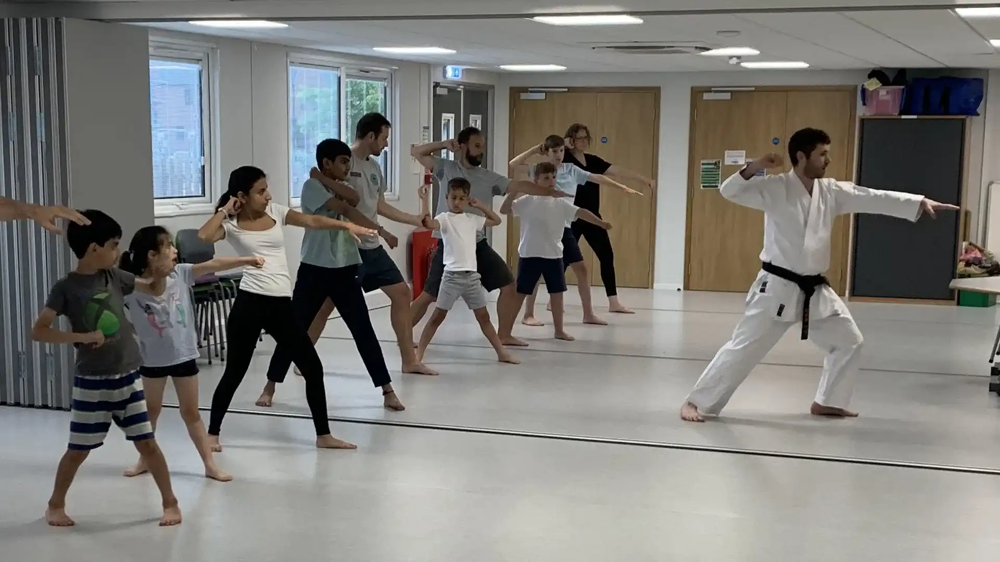
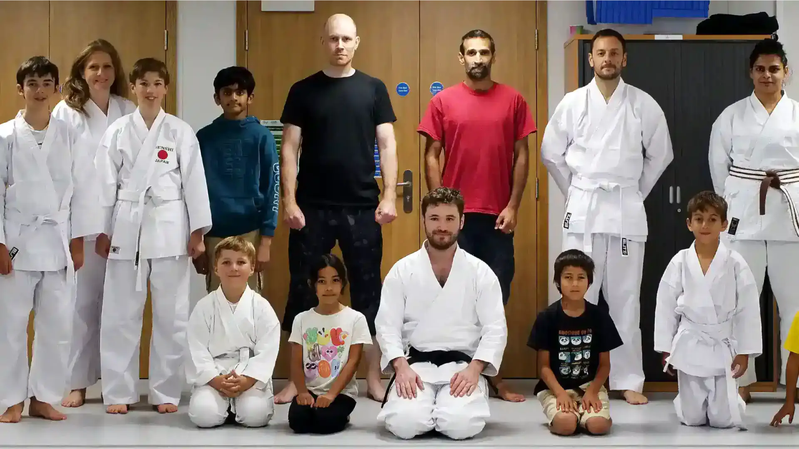
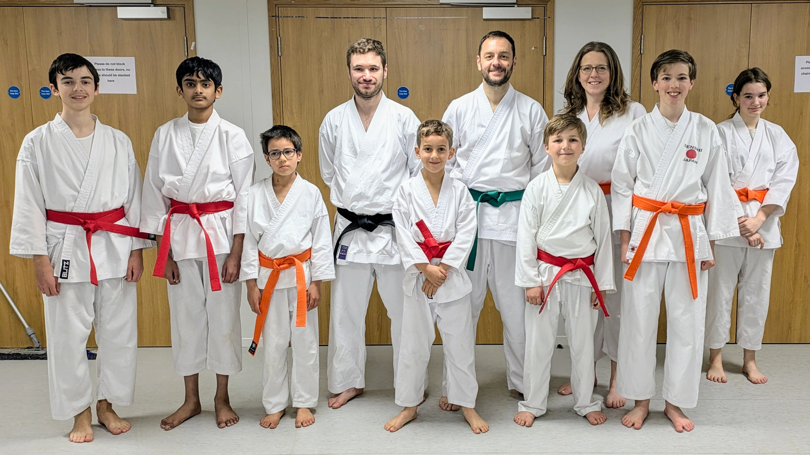

# Northstowe Karate Club

At Northstowe Karate Club, we are committed to teaching traditional Shotokan Karate in a supportive and friendly environment. Whether you are a beginner or an experienced practitioner, our club offers a place for everyone to learn, grow, and achieve their personal best. Northstowe Karate Club is proud to serve our local community in Northstowe while being part of the wider Cambridge martial arts scene. We welcome students from across the region and train in the spirit of Shotokan Karate, with strong ties to the Cambridge area.

## About the club

[Our club](/about/) teaches traditional [Shotokan Karate](https://en.wikipedia.org/wiki/Shotokan), a Japanese martial art, in Northstowe on the outskirts of Cambridge. We are a member of [Japan Shotokan Karate England](https://jske.co.uk) and are affiliated with the [Japan Karate Association](https://www.jka.or.jp/en/), which is one of the largest and most prestigious karate organisations in the world.

Below are a few photos from recent classes, events and grading sessions.

  

    

      
    

    

      
    

    

      
    

  

## Training Sessions

We're a family friendly club, where children (8+) and adults can both train together. We will consider students aged 6-7 on a case-by-case basis. Regular [training sessions](/training/) are held on Wednesday evenings from 6.30-7.30pm and Sunday afternoons 3-4pm at [The Cabin](https://maps.app.goo.gl/wXcMAGknwyPFEgMp6). We recommend young children train alongside their parent/guardian for the first few lessons while they gain confidence in the unfamiliar environment.

**Please note our Wednesday sessions are very busy and we may not have space available. We have better availability on Sundays.**

### Our Teaching Style

Our teaching style balances discipline with encouragement. Classes are structured but friendly, with a focus on steady progress and personal growth. We aim to create a respectful and motivating atmosphere where students can thrive at their own pace.

### What to expect
Although no two lessons are the same, our [lesson format](/training/what-to-expect/) is usually structured around kihon (basic techniques), kumite (sparring) and kata (forms). We build up your confidence gradually. We're a non-contact club, and you won't be expected to fight until you've learnt the basics, and even then it's under controlled conditions with known attacks and blocks until you're very experienced. Injuries are rare - please speak to the instructor if you have any concerns. There is an element of risk to all sports and exercise, including martial arts - please see our [assumption of risk document](/policies/risk/) for details.

## Benefits of Karate

Karate has many [benefits](/benefits-of-karate/). While learning to defend yourself, you'll gain fitness and become healthier. You'll also become more confident, and it's a great place to make friends.

## Is Karate Right for You?

We welcome students of all backgrounds and abilities. Whether you're looking to improve your fitness, build confidence, or simply try something new, our inclusive approach ensures everyone feels supported. Parents and guardians are encouraged to train alongside younger children to help them settle in.

## Fees
Your first lesson is always free, and after that you [pay per session](/training/fees/). To book your first class, please [get in touch](/contact/). Please arrive 5 minutes early for your first session so you can be registered. To train regularly, you will also need to purchase an annual membership.

## Chief Instructor
Simon Apen-Sadler, the [chief instructor](/instructors/), has over 20 years experience. He is a 4th dan black belt, is first aid qualified and has a enhanced DBS check.

## Social media

Follow us for class updates, grading news, and behind-the-scenes glimpses of club life. Got questions? We’re happy to chat - just drop us a message.

Check us out on [Facebook](https://www.facebook.com/profile.php?id=61560001297561) and [Instagram](https://www.instagram.com/northstowekarate)

