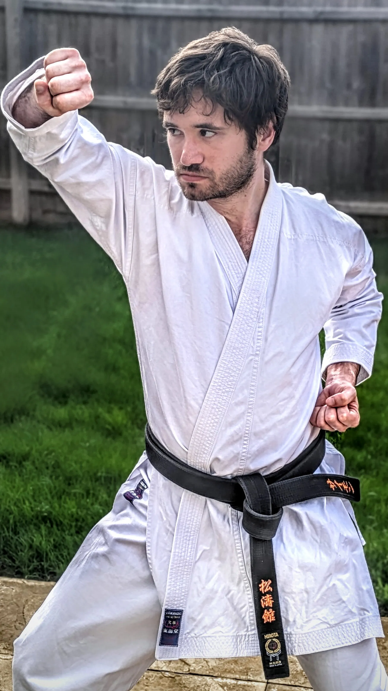

# Meet Our Instructors

## Simon Apen-Sadler

Simon Apen-Sadler, 4th Dan JKA, is the Chief Instructor of Northstowe Karate Club. He started training in 2000 at the age of 8 with SKA Romford, earning his Shodan in 2008 and Nidan in 2010. At university, he then started training with Jim Lewis sensei at Imperial College Shotokan Karate Club (KWF) in 2010, where he achieved Sandan in 2013 and obtained D-level Instructor, Judge, and Examiner qualifications. He achieved yondan with the JKA in 2024.

Simon continues to train and develop his skills. He regularly trains at [Cambridge Karate Dojo](https://cambridgekaratedojo.com) under the guidance of Ken Hori sensei. Notably, in April 2024, he travelled to Tokyo and Okinawa with [JSKE](https://jske.co.uk), training with top JKA instructors and traditional Okinawan masters.

### Certifications
  <ul class="overflow-hidden">
    <li>
      Enhanced DBS Certification
    </li>
    <li>
      D Grade Examiner
    </li>
    <li>
      C Grade Instructor
    </li>
    <li>
      C Grade Judge
    </li>
    <li>
      BMABA Level 2 Instructor Award
    </li>
    <li>
    BMABA Martial Arts First Aid Essentials
    </li>
  </ul>

### Competition Results
  <ul class="overflow-hidden">
    <li>
      2016 KWF England Nationals Team Kata Gold Medallist Imperial College Shotokan Karate Club
    </li>
    <li>
      2013-2014 British University and Colleges Sport (BUCS) Team Kata Bronze Medallist, Imperial College Shotokan Karate Club
    </li>
    <li>
      2012 KWF England U21 Kumite Gold Medallist
    </li>
  </ul>

### BMABA Register

Simon is registered with the BMABA (British Martial Arts and Boxing Association). You can verify instructor details on the [BMABA website](https://bmaba.org.uk/verify/).

## Teaching Philosophy

Simon believes in balancing discipline with encouragement, helping every student progress at their own pace and fostering a respectful, inclusive environment.

