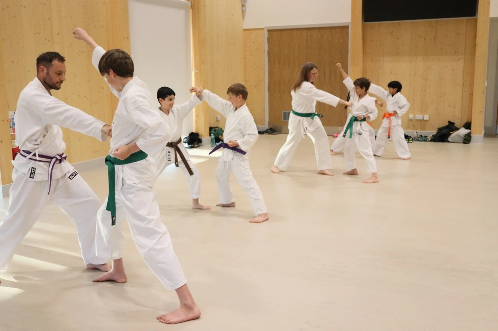

  
  

    <h1 class="display-5 fw-bold">Karate Classes — Cambridge Area</h1>
    
Traditional Shotokan karate for children (8+), adults and families. Join a friendly club close to Cambridge.

    <a href="/lesson-booking/" class="btn btn-brown btn-lg px-4 mb-3">Book a free trial</a>
  

At Northstowe Karate Club, our lessons start with a warm-up, followed by a combination of practicing techniques (kihon), partner drills / sparring (kumite) and kata - with clear progression via belt gradings. Find our more at our [what to expect](/training/what-to-expect/) page.

## Venue & Directions

Training is at the Unity Centre, Northstowe (CB24 1FD) — less than 30 mins drive from Cambridge. <a href="https://maps.app.goo.gl/wXcMAGknwyPFEgMp6" target="_blank">Open map</a>.

### Parking & accessibility

- Community centre carpark and short-stay parking nearby at Pathfinder Primary School and Longstanton Park and Ride
- Ground-floor hall with step-free access

### Nearby villages served

We serve Cambridge, Northstowe, Longstanton, Oakington, Histon, Cottenham and other Cambridgeshire villages. Our classes welcome children, adults and families — see our dedicated kids and adult pages for specialist information.

## Training Schedule

We train twice a week on Wednesday evenings and Sunday afternoon. Please see our [Class schedule](/training/) for more information.

## Fees
      
First lesson free. £5 per person per session. Family discounts available. Membership required for permanent students. See our <a href="/training/#fees">fees page</a> for full details.</li>

## Who trains with us?

Our classes are designed to be welcoming and useful for:

- **Kids (age 8+)** — age-appropriate lessons that build coordination, focus and social skills. See our benefits on the [Benefits of Karate](/benefits-of-karate/) page.
- **Adults** — beginners and returning students welcome; training improves fitness, mobility and confidence.
- **Families** — family sessions and mixed-age training are supported; many families train together.

Want more detail? Read our [What to expect](/training/what-to-expect/) guide and the full <a href="/faq/">FAQ</a> for practical information about classes, safety and grading.

## Contact

You can contact us via email at <a href="mailto:info@northstowekarate.com">info@northstowekarate.com</a>. For alternative contact details see our [Contact Us](/contact) page.

Click below to book a free trial.

  <a href="/lesson-booking/" class="btn btn-brown btn-lg px-4">Book your free trial</a>

