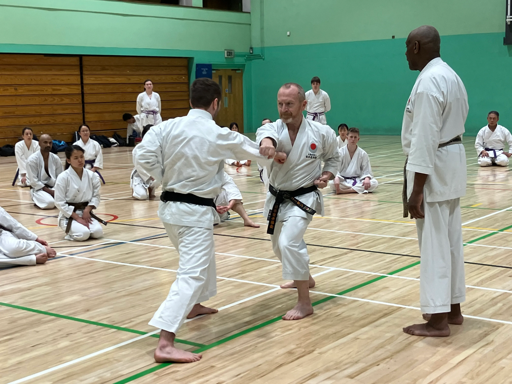
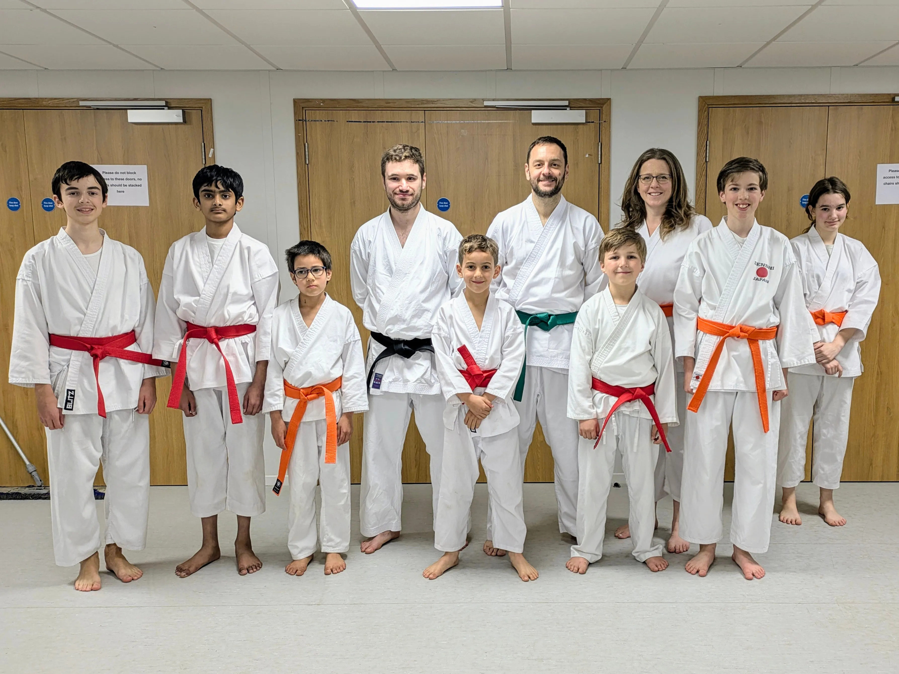

# Grading - 22nd March 2025

A total of 79 students graded this weekend from 3 clubs: Cambridge Karate Dojo, Cambridge University Karate Club and Northstowe Karate Club. All 79 students passed with 11 from Northstowe Karate Club. Special shout out to Victor and Jasper who double graded to 8th Kyu.

The grading started with a session for advanced students 1-2pm, followed by a beginners session 2-3pm. The grading then started at 3pm.

Several senior grades also were presented with their dan grades: Joe (Yondan), Simon (Yondan), Loizos (Shodan) and Salman (Shodan).

  

    

      
    

  

   
  

    

      
    

    

      
    

    

      
    

  

